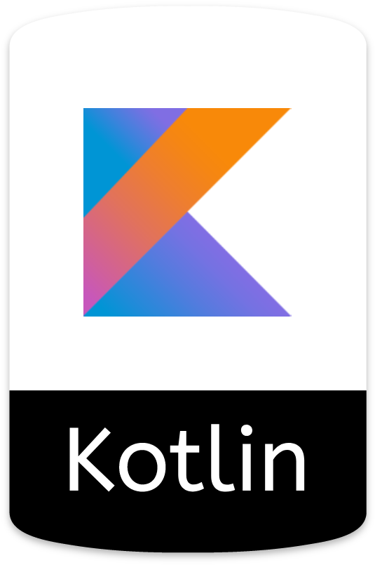
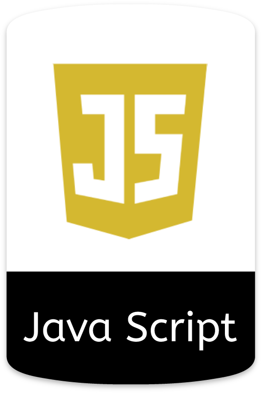
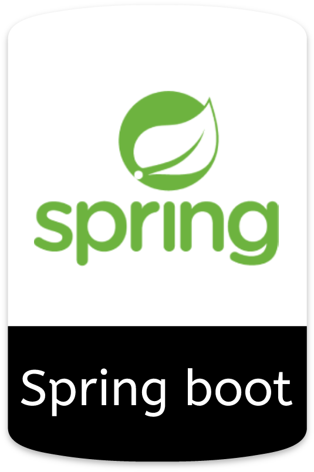
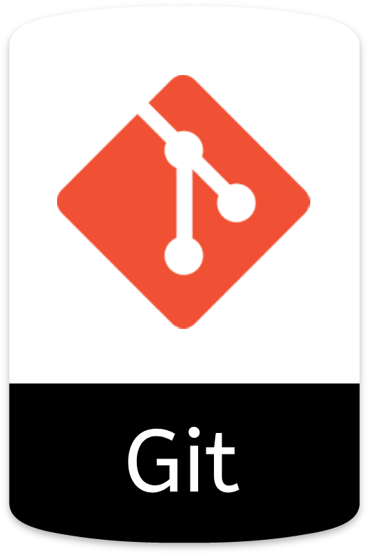

 

I'm a self-taught passionate FullStack developer from Iran

**About me**

- 💼 CTO - Software Engineer at [Otamin](http://otamin.com/)

- 📈 Built github-readme-stats, verlyjs and more, **50m+** hits • **31K** stars on GitHub

- 💬 Ask me about anything [here](https://github.com/jashakouri/jashakouri/issues)

- Languages

  
  
  
  

- Frameworks

  
  
  

- Tools

  
  
  

|  |  |
| ------------- | ------------- |

#### Top Repositories

 
 

