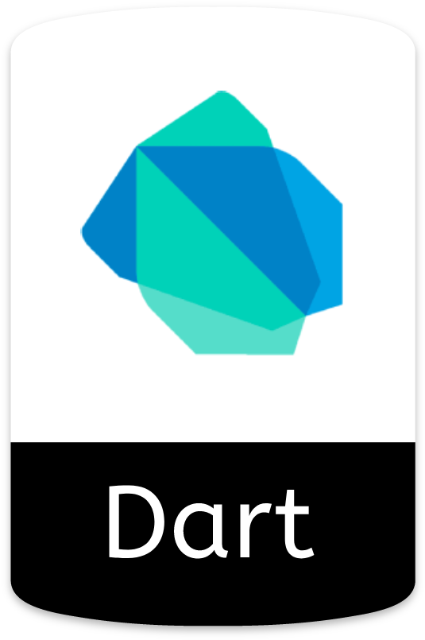

<!-- 

 -->

|  |  |
| - | - |

I'm a self-taught passionate FullStack developer from Iran

**About me**

- 💼 CTO - Software Engineer at [Otamin](http://otamin.com/)
- Advance experience with java spring, android native with java and kotlin, advance flutter and beginner on react

- 💬 Ask me about anything [here](https://github.com/jashakouri/jashakouri/issues)

 

**Languages**

  
  
  
  

 

**Frameworks**

  
  
  

 

**Tools**

  
  
  

#### Top Repositories

 

<!-- 
 -->
